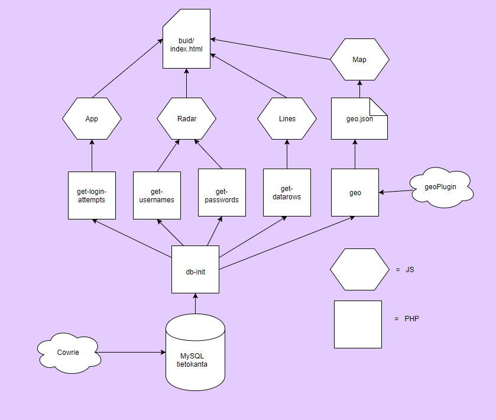

# TTMS0500/0900 Web- ja palvelinohjelmoinnin harjoitustyö

### Matti Ruusupiha & Mikko Seppänen

25.11.2017

### Tehtävän kuvaus

Päätimme yhdistää molempien kurssien (ttms0500 ja ttms0900) harjoitustyöt yhdeksi kokonaisuudeksi. Koska olemme molemmat
suuntautuneet kyberturvallisuuteen, päätimme, että harjoitustyömme tulee olemaan jotenkin yhteydessä kyberturvallisuusasioihin.
Saimme ajatukseksemme rakentaa niin kutsutun "honeypot" -serverin. Tällaisen serverin tarkoituksena on ylläpitää virtuaalista
käyttöjärjestelmää, johon kirjautuminen ei vaadi autentikoitumista. Tällaiset serverit ovat omiaan houkuttelemaan hakkereita ja
botteja, jotka kirjautuvat "honeypot" -serverille ja toimivat siellä paha-aikeisesti. Tämä toiminta kirjataan lokeihin, ja 
tietoturva-asiantuntijat voivat tutkia näitä lokeja selvittääkseen bottien ja hakkereiden trendejä. Päätimme rakentaa nettisivun, jonka
avulla voisimme visualisoida kyseistä dataa ja kerätä mielenkiintoista statistiikkaa.

### Ympäristön rakentaminen

Lyhyen etsinnän jälkeen päätimme käyttää "honeypot" ympäristönämme [Cowrie](https://github.com/micheloosterhof/cowrie) -hunajapurkkia,
joka perustuu jo meille ennestään tuttuun Kippoon. Cowrie mahdollistaa lokien tallentamisen sekä MySQL -tietokantaan että JSON -
tiedostoon. Alustaksemme valitsimme Ubuntu VPS:n. [Asensimme](lamp.md) serverille Apachen ja php moduulit sekä 
[MySQL serverin](mysql.md) myöhempää käyttöä varten.

Cowrien [asentaminen](cowrie.md) sujui melko vaivatta. Yritimme ensin [lukea](write-to-database.php) Cowrien json -tiedostoa ja 
kirjoittaa
tämän datan MySQL -tietokantaan. Tämä metodi alkoi kuitenkin tuntua meistä hieman vaivalloiselta, siellä cowriessa oli oma MySQL -
tietokantaan tallennusfunktionaalisuus. Lisäksi kirjoittamamme php scripti joskus kirjoitti JSON tiedoston alkuun NULL -tavuja, joka
vuorostaan aiheutti sen, että seuraavalla lukukierroksella luku osittain epäonnistui. Näistä syistä päätimme konfiguroida 
[Cowrien oman](cowrie-mysql.md) tietokantaankirjoittamisfunktionaalisuuden. Tämä toimi moitteetta.  

#### NPM ja käytetyt paketit  

NPM on paketinhallintajärjestelmä Javascriptille. Se on vakiona Node.js:llä ja asentuu automaattisesti sen yhteydessä. Se koostuu komentoriviclientistä sekä tietokannasta, joka sisältää julkisia sekä yksityisiä paketteja. Päätimme käyttää tätä, sillä monet ominaisuudet jota käytämme ohjelmassa tarvitsee pakettejä joita asensimme NPM:n kautta. Nämä paketit ovat listattu alla olevassa Json- tiedostossa:
```
{
  "name": "data-visualization",
  "version": "0.1.0",
  "private": true,
  "devDependencies": {
    "@amcharts/amcharts3-react": "^3.0.0",
    "react": "^16.0.0",
    "react-dom": "^16.0.0",
    "react-scripts": "1.0.14"
  },
  "scripts": {
    "start": "react-scripts start",
    "build": "react-scripts build",
    "test": "react-scripts test --env=jsdom",
    "eject": "react-scripts eject"
  },
  "dependencies": {
    "axios": "^0.17.1",
    "webpack": "^3.8.1"
  }
}

```
Tämä toimii suorittamalla ```npm install``` komento siinä kansiossa jossa projekti sijaitsee, jolloin NPM asentaa kaikki tästä package.json tiedostosta löytyvät "riippuvuudet". Tämän jälkeen niitä voidaan kutsua käyttöön ohjelmassa. Riippuvuuksia voidaan asentaa erillisellä komennoill suoraan, jolloin ne lisätään automaattisesti kyseiseen Json- tiedostoon.  

Ohjelman alustukseen käytimme näiden lisäksi [react-create-app](https://github.com/facebookincubator/create-react-app)- pakettia. Tämä asennetaan komennolla: ```npm install -g create-react-app```tässä -g tarkoittaa globaalia, joten se on käytössä kaikkialla, muussa tapauksessa paketit asentuvat vain siihen projektiin jonka kansiossa komento suoritetaan. Tämän jälkeen komento ```create-react-app data-visualization``` luo pohjan projektille nimeltä data-visualization. Käytännössä tämä luo kansiorakenteen ja pohjatiedostot joihin voi aloittaa react- sovelluksen luomisen. Projektin Javascript osuus tehtiin tätä pohjaa hyödyntäen. React-create-app sisältää myös monia muita hyödyllisia ominaisuuksia, kuten dev-server, jolla voi hostata sivuja samalla kun työstää niitä, nähden kaikki muutokset heti sekä tarkat ja hyvin laajat virheilmoitukset.    


Muut paketit tiedostossa ovat itse selitteiset React ja React-dom. sekä react-scripts, joka sisältää create-react-app:in käyttämät scriptit. Graafien pirtämiseen käytetään [AmCharts](https://www.amcharts.com/)- pakettia, tämä on monipuolinen ja Linkwarena ilmainen visualisointikirjasto. Premium versiossa saisi vesileimat/linkit poistettua, mutta emme anna niiden häiritä. Webpackin toiminnallisuudet ovat suurilta osin react-create-scripteissä, mutta se tarvittiin jostain syystä erikseen jotta AmCharts saatiin toimimaan. Viimeiseksi käytettiin [Axios](https://www.npmjs.com/package/axios)- pakettia. Tämä on eräänlainen ajax- vastine jota käytimme Json- datan hakemiseen javascript ohjelmiin. Käytimme tätä jQueryn sijaan, sillä sen pitäisi olla nopeampi ja paremmin Reactin kanssa yhteensopiva. 


### Käytännön toteutus

Tämän jälkeen olikin aika ryhtyä visualisoimaan dataa. Päätimme aloittaa viivagraafista, joka näyttäisi kirjautumisyritysten määrän
päivämäärää kohti. Ensiksi kirjoitimme tietokannan [alustusskriptin](init-db.php), joka sijoitettiin kansioon, jota Apache ei pääse 
lukemaan. Tätä alustusskriptiä tulevat käyttämään kaikki sitä seuraavat php -skriptit. Tämän jälkeen kirjoitimme
[get-login-attempts](ajax/get-login-attempts.php) -skriptin, joka hakee tietokannan "sessions" -kansiosta kirjautumisten 
aloitusajankohdat. Ajankohdat yleistetään päivän tarkkuudelle käyttämällä explode -funktiota välilyönnin kohdalla. Tämä data luetaan 
array -tietorakenteeseen käyttäen kätevää php:n array_count_values funktiota, joka antaa meille suoraan
tietorakenteen, jonka jokaisen tietueen avaimena on kirjautumispäivämäärä ja arvona kyseisenä päivänä tapahtuneiden kirjautumisten 
määrä. Tämä array puolestaan kirjoitetaan json -muotoon ja palautetaan. 

Ensimmäisen graafin visualisointiin käytimme AmChartsin viivagraafia, joka rakennettiin [App.js]( ttms/data-visualization/src/App.js )- tiedostoon. Tähän tiedostoon luotiin luokka App. Tämän graafin "tilaan" alustetaan taulukko: dataProvider, johon Axiosia käyttäen haetaan PHP-ohjelman antama data kirjautumisista. Tätä tilaa päivitetään 15 sekunin välein, jotta graafi pysyy ajan tasalla. Tämän lisäksi luodaan render()- funktioon muuttuja "config", johon alustetaan kaikki graafin muotoilut ja asetukset, sekä "dataProvider" kohtaan aikaisemmin säädetty this.state.dataProvider- taulukko. Lopulta render- funktio palauttaa div-elementin jonka luokkana on App, ja jonka sisälle kyseinen graafi tulostuu. Tämä luotu App- luokka "exportataan" ja kutsutaan muiden luokkien kanssa index.js tiedostosta.


Seuraavana oli vuorossa hunajapurkkiin pyrkivien maantieteellisen sijainnin selvittäminen ja visualisoiminen karttaan. Tätä tehtävää
varten päätimme käyttää hyödyksi [geoPlugin](http://www.geoplugin.com) API:a. Valitsimme geoPluginin siitä syystä, että heidän 
palveluihinsa sisältyy php -palvelu, joka kutsuttaessa palauttaa php:lle sopivan array -tietorakenteen. Tieto käsittelevä 
[geo.php](geo.php) lukee tietokannasta 65 viimeisintä kirjautumisyritystä ja palauttaa niihin liittyvät yksilölliset ip -osoitteet 
(ei duplikaatteja). Tämän jälkeen kyseiset osoitteet loopataan ja jokaista kohden tehdään geoPlugin kysely. Ensin ajattelimme
kutsua suoraan tätä skriptiä datan visualisointisivulta. Emme kuitenkaan ottaneet huomioon sitä, että jokaisella sivun latauskerralla
loimme runsaasti liikennettä geoPlugin API:in. He muistuttivat meitä tästä faktasta antamalle meille tunnin bännit. Tämän jälkeen
päätimme ajaa geo.php:n cronjobilla joka viides minuutti, ja kirjoittaa tulokset erilliseen json -tiedostoon, jota datan 
visualisointisivu lukee. Näin luomamme liikenne ei rasita turhaan geoPlugin API:a. Geo.php sijoitettiin kansioon, johon ei voi 
selata selaimella, jotta voimme olla varmoja siitä, että ylimääräistä liikennettä geoPlugin API:in ei luoda.

Kartan graafi luotiin hyvin samalla menetelmällä kun aikaisempi viivagraafi. Erona se, että koko dataProvideria ei täytetä Jsonilla, vaan sen sisältä löytyvä images- taulukko. tämä luotiin tiedostoon [Map.js]( ttms/data-visualization/src/Map.js ). Tämä data päivitetään 5 minuutin välein, jotta se pysyy synkassa cronjobissa määritetyn PHP-ohjelman kanssa. Esimerkki kartan käyttämästä Jsonista:
```
{
      "scale": 0.5,
      "title": "89.250.23.2 FI </br> Helsinki",
      "latitude": 60.1858,
      "longitude": 25.7273,
	  "type": "circle"
    }
```
Tässä "scale" ja "type" ovat vakiomuotoiluja kartan merkinnöille, mutta ne täytyy silti laittaa jokaiseen kohtaan erikseen. loput tiedot saadaan geopluginin palauttamasta datasta.

Mielestämme olisi myös mukavaa nähdä dataa kaikkein eniten käytetyistä salasanoista ja käyttäjänimistä. Niimpä kirjoitimme kaksi
skriptiä, [get-passwords.php](ajax/get-passwords.php) ja [get-usernames.php](ajax/get-usernames.php). Nämä skriptit eivät käytännössä 
eroa muuten toisistaan kuin sen datan perustella, mitä ne hakevat tietokannasta. Data luetaan array -tietorakenteesta sekä muutetaan
json -muotoiseksi ja palautetaan.

Tämän visualisointiin päätimme käyttää AmChartsin radar- graafeja. Koska tarvitsimme kaksi samanlaista graafia, alustimme ne samaan tiedostoon [Radar.js]( ttms/data-visualization/src/Radar.js ). Tässä tiedostossa piti hakea erikseen kaksi eri Jsonia, joka onnistui näppärästi Axiosin avulla. Jsonit tallennettiin erillisiin taulukoihin, joista ne annettiin parametreiksi erillisille "config" muuttujille. Molemmat graafit renderöitiin saman div-elementin sisälle.

Loppuhuipennukseksi päätimme vielä luoda taulukon, jossa näkyisi 10 viimeisintä kirjautumisyritystä ip-osoitteineen, 
autentikointidatoineen höystettynä aikaleimalla. Tätä varten kirjoitimme [get-datarow.php](ajax/get-datarow.php) -skriptin, jonka
SQL tiedustelu palautti meille juuri tarvitsemamme datan. Tämän tiedustelun kirjottaiminen olikin tehtävän palvelinosuuden vaikein
kohta, sillä kun data saatiin array -rakenteeseen, se oli helppo tuttuun tapaan muuttaa json -muotoiseksi ja palauttaa. 

Javascripti tämän visualisointiin luotiin [Lines.js]( ttms/data-visualization/src/Lines.js ) tiedostoon. Jälleen kerran samat Axios kyselyt hakevat tarvitsemamme datan PHP-ohjelmalta. Render functioon luotiin datan palauttamiseen table- taulukko, johon rivit saatiin map- funktiolla linesArray- taulukosta.

Seuraavaan rakennekaavioon olemme kuvanneet serverin käyttämien palveluiden ja tiedostojen suhteita.

###### Rakennekaavio



Parempaa käyttäjäkokemusta silmällä pitäen rekisteröimme sivumme käyttäen [FreeDNS](https://freedns.afraid.org/) nimipalvelua, sekä
kirjoitimme [aloittussivun](landing_page/index.html), jossa luetellaan projektissa käyttämämme oleelliset ulkoiset palvelut ja joka 
sisältää linkin datan visualisoimissivulle. Rekisteröimme myös uuden domainimme geoPlugin -palveluun. Kirjoitimme aloitussivua varten
pienen javascriptin, joka css filter -ominaisuutta käyttäen hitaasti vaihtaa aloitussivun taustakuvan kontrastia, mikä saa aikaan
eloisan hehkun.

### Ajankäyttö ja roolit

Tehtävämme jakautuivat melko selkeästi niin, että Matti keskittyä pääasiassa backend -ohjelmointiin ja Mikko frontend -ohjelmointiin. 
Teimme myös kuitenkin molemmat hiukan molempia, esimerkiksi Mikko suunnitteli suurimmaksi osaksi geo.php -skriptin geoIP osuuden, kun 
taas Matti esimerkiksi osallistui Lines.js tiedoston taulukon renderöimisfunktion tekemiseen. Työskentelimme monesti yhtä aikaa, ja
huomasimme tehokkaaksi seuraavan työjärjestyksen: Mikko selvitti ensin, millaista json dataa tarvittiin ja loi esimerkiksi json 
-tiedoston. Tämän jälkeen Mikko jatkoi tarvittavan .js sivun tekemistä, kun taas Matti ohjelmoi tarvittavan PHP -skriptin. Lopuksi
molemmat lyötiin yhteen ja korjattiin mahdolliset puutteet. Aikaa meni myös jonkin verran css- tiedoston tyylimääreisiin, jotta kaikki graafit ja taulukko saatiin oikeille paikoille, sekä värimaailma silmää miellyttäväksi.

###### Ajankäyttö:

Nimi | 17.11 | 18.11 | 19.11 | 20.11 | 21.11 | 22.11 | 24.11 | 25.11
------------ | ------------- | ------------- | ------------- | ------------- | ------------- | ------------- | ------------- | -------------
Matti | 6h | 4h | 6h | 8h | 5h | 2h | 8h | 5h
Mikko | 4h | 3h | 6h | 8h | 7h | 3h | 8h | 4h

### Itsearvio

**Matti:**   
Yleisesti ottaen olen tyytyväinen aikaansaannoksiini. Onnistuin hyödyntymään kurssilla oppimiani taitoja itseäni kiinnostavan 
kokonaisuuden rakentamiseen. Halutut toiminnallisuudet saatiin kuntoon.   
PHP koodin määrä jäi loppujen lopuksi hieman suppeaksi. Mahdollisia muita toiminnallisuuksia olisi suuremmalla ajankäytöllä saanut
implementoitua (vaikka php -pohjainen kirjautuminen, hoidetaan tällä hetkellä .htaccessilla). Sivun ulkoasu jäi myös vielä 
kehityskelpoiseksi.   
Kaiken kaikkiaan harjoitustyö oli erittäin mielenkiintoinen projekti, jonka ylläpitämistä saatan jatkaa vielä kurssin jälkeenkin.   
Arvosanaehdotus: 3,5   

**Mikko:**   
Tyytyväinen siihen, että saatiin toimimaan hyvin nämä asiat mitkä teimme. Vauhtiin pääsemisessä meni todella kauan, sillä NPM ja muut uudet asiat eivät tahtoneet lähteä alkuunsa rullaamaan. Kesti kauan että sai ensimmäisen AmChartin toimimaan React- ohjelmassa.

Koodia näin jälkikäteen ajateltuna ei älyttömiä määriä ole. Suuremmalla ajankäytöllä tätä olisi voinut laajentaa aika paljonkin, mutta ihan kivan näköinen sivu saatiin aikaiseksi

Arvosanaehdotus: 3,5
